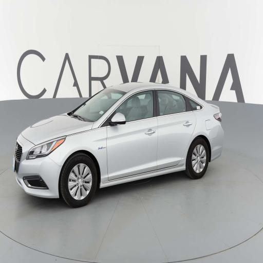
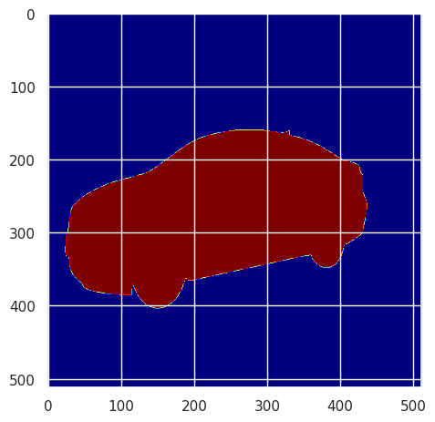
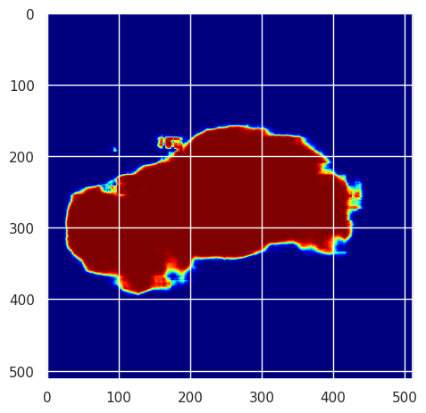

# carvana-car-image-segmentation

This repository contains image classification task program for carvana car masking data set found in Kaggle (https://www.kaggle.com/c/carvana-image-masking-challenge)

The data is converted to 512 x 512 images for both image and masks. The converted data is uploaded here.

For this task, UNET model was used, the trained model weights can be found [here](https://drive.google.com/file/d/1g5vvm3c0Amqzic0LP5mRXzBSIftLYXFU/view?usp=sharing) and sample real image and predictions are kept inside results/ directory.

`train.py contains training program`

`prediction.py is a command line program which can show prediction for a given input image and also shows prediction performance upon provided label/mask image.`

Sample image input

Label image

Corresponding Prediction

